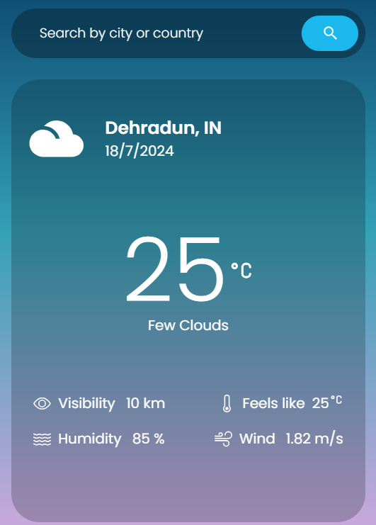

# Real-Time Weather App

## Overview

The Real-Time Weather App is a web application built using React.js that provides users with current weather information for any location in the world. The app uses weather data from a third-party API to display real-time weather conditions, including temperature, humidity, wind speed, and more.

## Features

- **Real-Time Weather Data**: Get up-to-date weather information for any location.
- **Search Functionality**: Search for weather by city name or geographic coordinates.
- **Responsive Design**: The app is designed to work on all screen sizes, from mobile devices to desktops.
- **User-Friendly Interface**: Clean and intuitive interface for easy navigation.
- **Error Handling**: Proper error messages for invalid inputs or API issues.

## Demo

[View the live demo](https://adii-10.github.io/weather-app/)

## Screenshots

## Technologies Used

- **React.js**: JavaScript library for building user interfaces.
- **Vite**: Frontend tooling for development and build.
- **Axios**: Promise-based HTTP client for making API requests.
- **OpenWeatherMap API**: External API for weather data.
- **CSS/Styled Components**: Styling the application.

## Getting Started

### Prerequisites

- Node.js (v14 or later)
- npm or yarn
